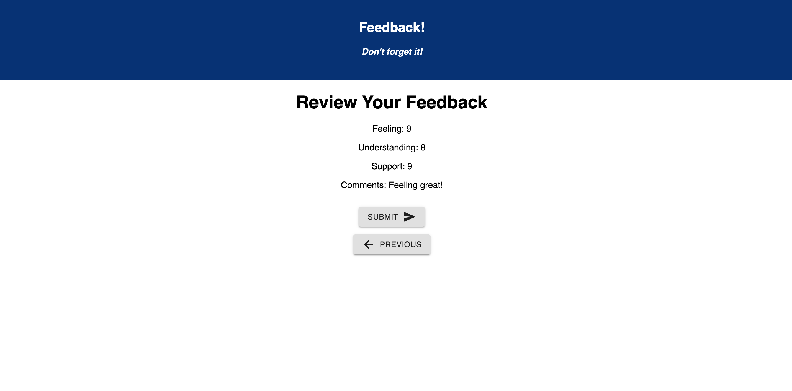

# React/Redux Feedback!

## Description

_Duration: Weekend_

Web app that allows the user to enter feedback using four different forms: feeling, understanding, support, and comments.

## Screen Shot

## Installation

To initialize the database, create a new database in your local/localhost route called "prime_feedback". Inside of that database, using Postico or another SQL app, run the SQL queries provided in data.sql to get the initial table up and running with some test data.

Download the repository and [node.js](https://nodejs.org/en/download/) if you do not already have node.  With the folder open in your terminal, run 'npm install' inside the terminal window. Run 'npm run server' inside of this terminal window, and then open an additional terminal window inside the repository. Inside of this terminal window, run "npm run client".

## Usage

- The user will be brought to the home page, which is the "feeling" portion of the feedback, when the user enters a number between 1-10, they will be allowed to click next and move on to the next page.
- In the following pages, the user will repeat this process with different categories, and they are allowed to move to the previous page to change answers.
- If the user moves to the previous page, their previous answer will still be displayed in that input field using redux.
- Once the user reaches the review page, they can review their answers, and submit their feedback to the database. 
- If the database upload happens successfully, they'll be brought to a success page where they can move back to the beginning of the process.

## Built With

HTML, CSS, @material-ui, javascript, react, react-redux, node, express, axios, postgresql.

## Acknowledgement
Thanks to [Prime Digital Academy](www.primeacademy.io) who equipped and helped me to make this application a reality.
